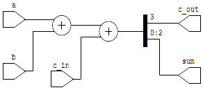

# Make Your verilog Testbench and RTL diagram!

Setup enviroment

```
 $ make setup
```

Make Build fulladder example and testbench.

```
make
```

Do GTK wave.

```
make sim
```

Make svg file to view netlist.

```
make netlist
```



Figure 001. fulladder
